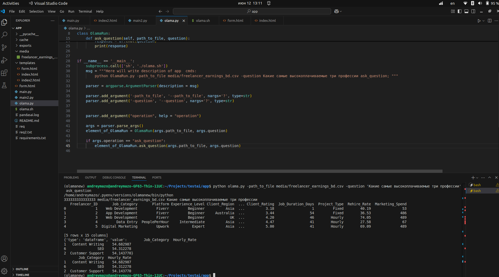

Проект запилин под Убунту 22.04 Ram больше или равно 16 Гб.  С другими системами не запускайте, надо другую команду курл вставить. Ну или установите Ollama и модель T-lite-it-1.0-Q8_0-GGUF с Huggingface и сразу команду запускайте.

При запуске будет запущена команда "curl -fsSL https://ollama.com/install.sh | sh" согласно https://hostkey.ru/documentation/technical/gpu/ollama/

В командной строке вводим путь до csv файла, который должна обработать модель и вопрос. Ответ распечатается в консоли. Используется модель T-lite-it-1.0-Q8_0-GGUF с Huggingface

###
        python OlamaRun -path_to_file <Тут путь к вашему файлу> -qustion <Тут ваш вопрос> ask_question

Скрин как работает

  

